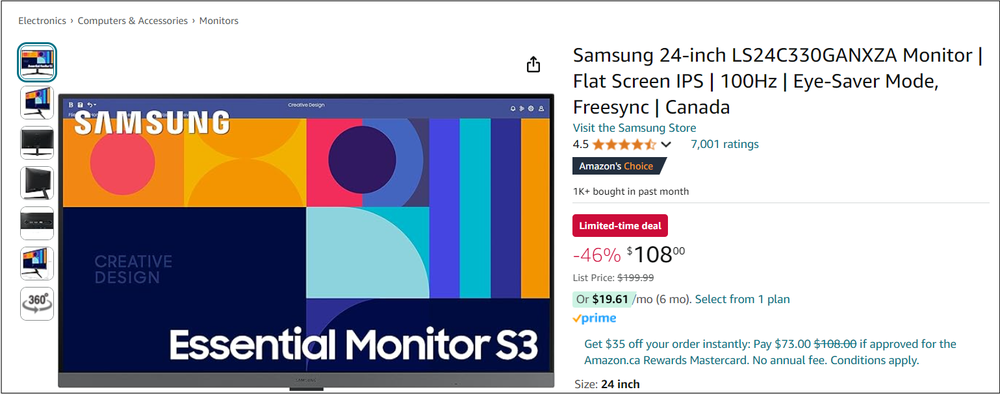
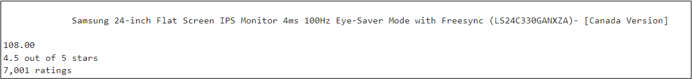
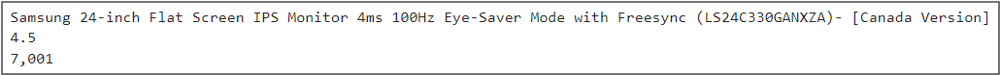

# Web Scraping With Python

## Objective

The primary goal of this project is building web scraping tool that automates the process of collecting product information from Amazon such as name, price, and customer reviews. The scraped data will provide insights into market trends, pricing fluctuations, and product popularity over time.

## Scope of Work

- Target Website: Amazon (Product pages)
- Key Data Points to Scrape:
  - Product name
  - Product price
  - Product Rating (stars)
  - Number of customer reviews
- Technologies and Tools:
  - Python
  - BeautifulSoup for HTML parsing
  - Requests for sending HTTP requests
  - Pandas for data manipulation
  - CSV for data storage

## Implementation Steps

- Inspect Web Page Structre: Analyze the HTML structure of the Amazon product page to locate relevant data points.



- Develop Scraper: Write Python scripts using BeautifulSoup and Requests to fetch and parse product information.

```python
# Connect to website
URL = 'https://www.amazon.ca/Samsung-24-inch-Eye-Saver-Freesync-LS24C330GANXZA/dp/B0CJCLFCVX?pd_rd_w=EjBHs&content-id=amzn1.sym.e0b5b8df-c7a3-4462-b3fb-639731524e88&pf_rd_p=e0b5b8df-c7a3-4462-b3fb-639731524e88&pf_rd_r=X200QYK25P81SCM3CMEQ&pd_rd_wg=CAAqE&pd_rd_r=b33fe40b-98e8-4365-95f1-083b7774a16a&pd_rd_i=B0CJCLFCVX&ref_=pd_hp_d_btf_unk_B0CJCLFCVX&th=1'

headers = {"User-Agent": "Mozilla/5.0 (Windows NT 10.0; Win64; x64) AppleWebKit/537.36 (KHTML, like Gecko) Chrome/78.0.3904.108 Safari/537.36", "Accept-Encoding":"gzip, deflate", "Accept":"text/html,application/xhtml+xml,application/xml;q=0.9,*/*;q=0.8", "DNT":"1","Connection":"close", "Upgrade-Insecure-Requests":"1"}

page = requests.get(URL, headers=headers)

soup1 = BeautifulSoup(page.content, "html.parser")

#use prettify to look in a better format
soup2 = BeautifulSoup(soup1.prettify(), "html.parser")

title = soup2.find(id='productTitle').get_text()

price_whole = soup2.find(class_='a-price-whole').get_text(strip=True)
price_fraction = soup2.find(class_='a-price-fraction').get_text(strip=True)
price = f'{price_whole}{price_fraction}'

rating = soup2.find(class_='a-icon-alt').get_text(strip=True)

total_of_ratings = soup2.find(id='acrCustomerReviewText').get_text(strip=True)
```



- Error Handling and Optimization: Implement mechanisms to handle unneccesary values and blank spaces.

```python
title = title.strip()
rating = rating[0:3]
total_of_ratings = total_of_ratings[0:5]

# Create a Timestamp to track when data was collected
today = datetime.date.today()
```


- Data Storage: Store the scraped data in a CSV file.

```python
import csv 

header = ['Title', 'Price','Rating','Total_of_Ratings','Date']
data = [title, price, rating,total_of_ratings, today]

with open('AmazonWebScraperDataset.csv', 'w', newline='', encoding='UTF8') as f:
    writer = csv.writer(f)
    writer.writerow(header)
    writer.writerow(data)

#Now we are appending data to the csv
with open('AmazonWebScraperDataset.csv', 'a+', newline='', encoding='UTF8') as f:
    writer = csv.writer(f)
    writer.writerow(data)
```


## Deliverables:
- Python scripts for web scraping.
- A structured dataset (CSV) containing the scraped product data.
